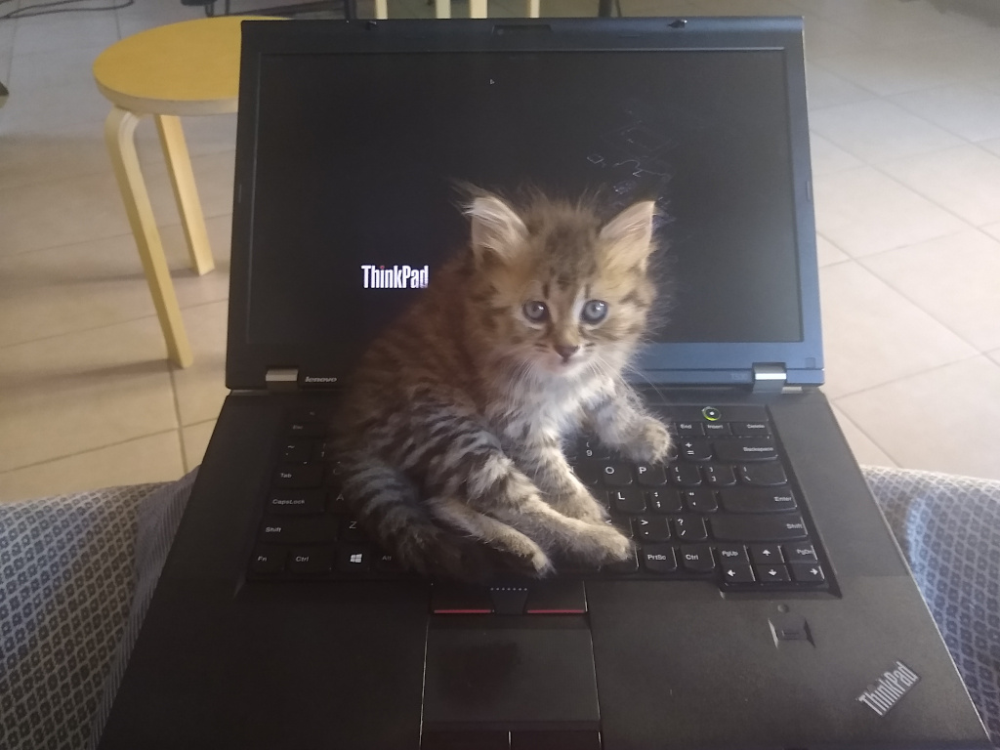

# Chaton

We've recently adopted this little alley kitten, that loves to unexpectedly jump
on my laptop keyboard. I've created this small utility to quickly disable my
keyboard and trackpad when needed on Linux.



## Install

```
sudo dnf install libevdev-devel
sudo usermod -a -G input $USER  # requires reboot
stack install
cp autostart/99-chaton.desktop ~/.config/autostart/
# logout and login to your GNOME session
# press `Fn` key for 1 second to enable Chaton mode
```

## Thanks

Thanks to George Thomas for developing [`evdev`](http://hackage.haskell.org/package/evdev-2.0.0.1).
